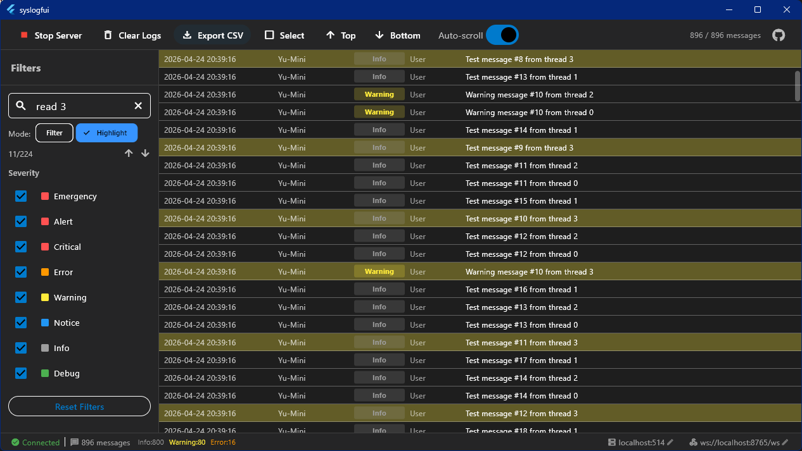
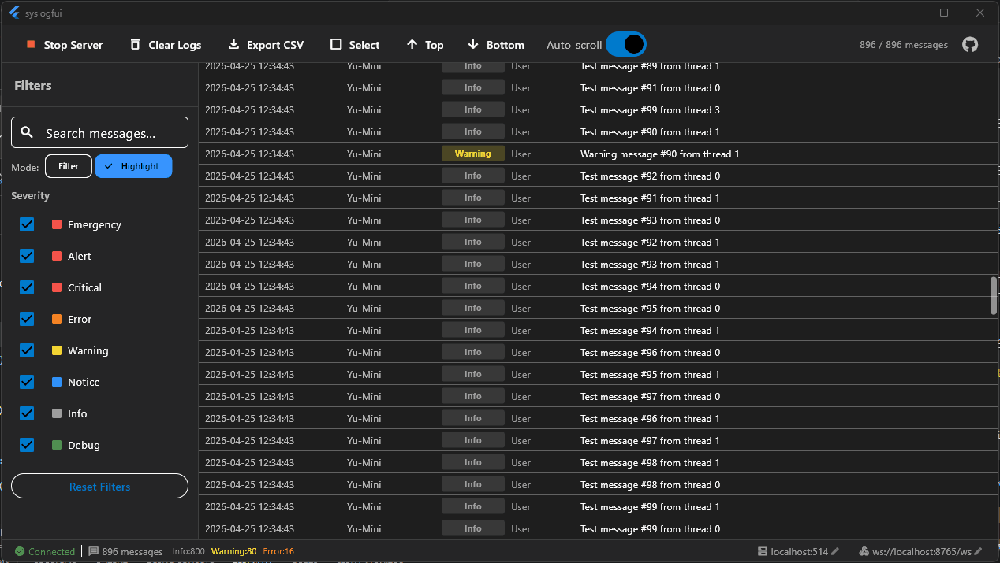

# SyslogFUI

[](https://opensource.org/licenses/MIT)
[](https://github.com/sky5454/syslogFUI)

A real-time syslog viewer desktop application with high-performance virtualized log display and AI integration.





## Features

- Real-time syslog reception via UDP/TCP
- High-performance display supporting 100,000+ messages with virtualized scrolling
- Severity-based color coding (Emergency/Alert/Critical=Red, Error=Orange, Warning=Yellow, Notice=Blue, Info=Gray, Debug=Green)
- Dark theme with high contrast
- Filter by severity level, facility, and search text
- Export logs to CSV
- WebSocket communication between Go backend and Flutter frontend

## Architecture

```
Syslog (UDP/TCP) → Go Backend → WebSocket → Flutter App → UI
```

- **Go Backend**: Syslog server using `gopkg.in/mcuadros/go-syslog.v2`, WebSocket handler using `gorilla/websocket`
- **Flutter Frontend**: BLoC state management, virtualized ListView for performance

## Usage

### Running the Built Application

```bash
# Release build
build\windows\x64\runner\Release\syslogfui.exe

# Debug build
build\windows\x64\runner\Debug\syslogfui.exe
```

### Sending Test Syslog Messages

Use the included test client or the `logger` command:

```bash
# Send via TCP (default)
logger -ntcp -p local0.info "Test message"

# Send via UDP
logger -nudp -p local0.info "Test message"
```

Or use the test client (after building):
```bash
go run ./go/clientTest --server=localhost:514 --protocol=tcp --threads=4 --count=100
```

### Configuration

Click on the address in the status bar to modify:
- **Syslog Address**: Default `localhost:514`
- **WebSocket URL**: Default `ws://localhost:8765/ws`

## Building from Source

### Prerequisites

- Go 1.21+
- Flutter SDK 3.0+
- Windows 10/11

### Build

From the project root:

```bash
dart run ./build.dart
```

This will:
1. Build the Go backend → `go/bin/syslog_viewer.exe`
2. Copy to Flutter build directories
3. Build the Flutter application

### Manual Build

#### Build Go Backend

```bash
cd go
go build -o bin/syslog_viewer.exe .
go build -o bin/clientTest.exe ./clientTest/
```

#### Build Flutter

```bash
flutter build windows --release
# or for debug:
flutter build windows --debug
```

### Build Output

| File | Location |
|------|----------|
| Go Backend | `go/bin/syslog_viewer.exe` |
| Flutter Release | `build/windows/x64/runner/Release/syslogfui.exe` |
| Flutter Debug | `build/windows/x64/runner/Debug/syslogfui.exe` |

## Project Structure

```
syslog_flutter_gui/
├── go/                          # Go backend
│   ├── main.go                  # Entry point
│   ├── go.mod                   # Go modules
│   ├── message/                 # Message types
│   ├── channel/                 # Message broadcasting & circular buffer
│   ├── syslog/                  # Syslog UDP/TCP server
│   ├── websocket/                # WebSocket handler
│   ├── http/                    # HTTP server (WebSocket upgrade)
│   ├── mcp/                     # MCP protocol for AI integration
│   └── clientTest/              # Test syslog client
│
├── lib/                         # Flutter app
│   ├── main.dart
│   ├── bloc/                    # BLoC state management
│   ├── models/                  # Data models
│   ├── services/                # WebSocket & backend services
│   ├── widgets/                 # UI components
│   └── theme/                   # App theme
│
├── build.dart                   # Build script
└── pubspec.yaml                 # Flutter dependencies
```

## Command Line Options (Go Backend)

```bash
./syslog_viewer.exe [options]

Options:
  --syslog=<addr>   Syslog server address (default: localhost:514)
  --protocol=<proto> Protocol: udp, tcp, or all (default: all)
  --http=<addr>      HTTP/WebSocket server address (default: localhost:8765)
```

## MCP Protocol (AI Integration)

The Go backend exposes an MCP-compatible HTTP API at `http://localhost:8765/mcp/` for AI integration.

### Endpoints

| Endpoint | Method | Description |
|----------|--------|-------------|
| `/mcp` | POST | JSON-RPC 2.0 MCP protocol endpoint |
| `/mcp/tools` | GET | List available tools |
| `/mcp/query` | POST | Direct log query |

### Available Tools

#### query_logs
Query syslog messages with optional filters.

```json
POST /mcp/query
{
  "limit": 100,
  "severity": "error",
  "keyword": "failed",
  "host": "server1"
}
```

Parameters:
- `limit` (number): Max messages to return (default: 100, max: 1000)
- `severity` (string): Filter by severity (emergency, alert, critical, error, warning, notice, info, debug)
- `keyword` (string): Search in message content
- `host` (string): Filter by hostname

#### get_statistics
Get statistics about received logs.

```json
POST /mcp
{
  "jsonrpc": "2.0",
  "method": "tools/call",
  "params": {
    "name": "get_statistics"
  }
}
```

Returns: total count, count by severity, count by facility, buffer capacity.

### Example: Claude Desktop Integration

Add to your Claude Desktop config:

```json
{
  "mcpServers": {
    "syslog-viewer": {
      "command": "curl",
      "args": [
        "-X", "POST",
        "-H", "Content-Type: application/json",
        "-d", '{"jsonrpc":"2.0","method":"tools/call","params":{"name":"query_logs","arguments":{"limit":50}},"id":1}',
        "http://localhost:8765/mcp"
      ]
    }
  }
}
```

### Direct Query Example

```bash
# Query last 50 error messages
curl -X POST http://localhost:8765/mcp/query \
  -H "Content-Type: application/json" \
  -d '{"limit": 50, "severity": "error"}'

# Get statistics
curl http://localhost:8765/mcp/tools
```

## GitHub Actions CI/CD

The project includes GitHub Actions workflows for automated building and releasing.

### Workflows

| Workflow | Trigger | Description |
|----------|---------|-------------|
| `ci.yml` | Push/PR to main | Run tests and quick builds |
| `release.yml` | Git tag `v*` | Build all platforms and create releases |

### CI Pipeline

On every push to `main`/`master` or PR:
- Run Go tests and linting
- Run Flutter analyze and tests
- Quick build Go binary
- Quick build Flutter Windows

### Release Pipeline

On every git tag `v*`:
- Build Go binaries for: Windows (amd64, arm64), Linux (amd64, arm64), macOS (amd64, arm64)
- Build Flutter Windows desktop app
- Create release packages (.zip, .tar.gz)
- Upload to GitHub Releases (draft)

### Setup

1. Push to GitHub
2. Go to Actions tab to see CI runs
3. To create a release:
   ```bash
   git tag v1.0.0
   git push origin v1.0.0
   ```
4. Go to Releases to publish the draft release

### Manual Trigger

You can also trigger the release workflow manually from the GitHub Actions tab.

## Interface Guide

| Component | Description |
|-----------|-------------|
| Toolbar | Start/Stop server, Clear logs, Export CSV, Auto-scroll toggle |
| Filter Panel (Left) | Severity checkboxes, Facility filter, Search box |
| Log Display (Center) | Virtualized log table with timestamp, host, severity, message |
| Status Bar (Bottom) | Connection status, message counts, severity breakdown, clickable addresses |

## Troubleshooting

### No messages received
- Ensure the sender is using TCP (Windows UDP loopback may be blocked)
- Check firewall settings
- Verify syslog address matches sender configuration

### Build fails with cpp_client_wrapper errors
```bash
# Clean Flutter build cache
rm -rf build windows/flutter/ephemeral .dart_tool
flutter pub get
flutter build windows
```

### Build fails
- Run `flutter clean` then rebuild
- Ensure Go and Flutter are properly installed
- Check that ports 514 and 8765 are not in use
